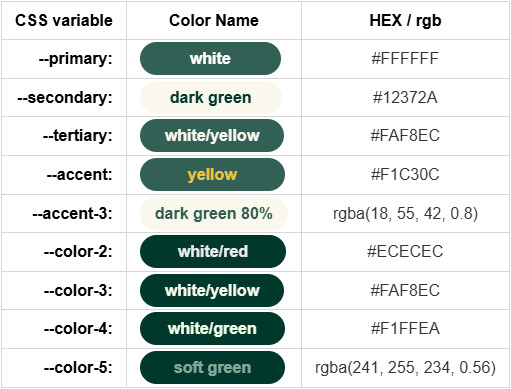

# StorAid Storage Services 📦

**StorAid** _offers secure, affordable storage solutions with easy online booking, flexible unit sizes, and reliable customer service for all your storage needs._

###### NOTE!

_For better readability, view this using 'Markdown Preview Enhanced'._

### 📑 Table of content:

🧰 - [Tech stack](#-tech-stack)
🌿 - [Branch naming](#-branch-naming-rules)
🎨 - [Color palette](#-color-palette)
🖋️ - [Fonts](#️-fonts)
🗒️ - [Comments](#️-comments)

### 🧰 Tech stack

| Technology   | Documentation                                                              |
| ------------ | -------------------------------------------------------------------------- |
| _Library_    | [**React**](https://react.dev/)                                            |
| _Language_   | [**JavaScript**](https://developer.mozilla.org/en-US/docs/Web/JavaScript)  |
| _Styling_    | [**CSS**](https://developer.mozilla.org/en-US/docs/Web/CSS)                |
| _Build Tool_ | [**Vite**](https://vite.dev/)                                              |
| _Deployment_ | [**Vercel**](https://vercel.com/docs)                                      |
| _WebAPI_     | [**SwaggerUI**](https://win25-jsf-assignment.azurewebsites.net/index.html) |

### 🌿 Branch naming rules

| Purpose   | Naming Pattern              | Example               |
| :-------- | :-------------------------- | :-------------------- |
| Feature   | feature/short-description   | feature/api           |
| Fixes     | fix/short-description       | fix/final-fixes       |
| Component | component/short-description | component/button      |
| Refactor  | refactor/short-description  | refactor/clean-navbar |
| Test      | test/short-description      | test/add-unit-tests   |

[Back to top](#storaid-storage-services-)

### 🎨 Color palette

[Back to top](#storaid-storage-services-)

### 🖋️ Fonts

`font-family: 'Urbanist', sans-serif;`
`font-family: 'Inter', sans-serif;`

### 🗒️ Comments

In the CSS-file there are comments with "MARK:"; These are for developers, and should not be removed unless the section is removed completely. The "MARK:"-command makes it easier to find the CSS for the components/sections you're looking for.

<!-- (code for color palette-image)
|     CSS variable | Color Name                                                                                                                           |         HEX / rgb         |
| ---------------: | ------------------------------------------------------------------------------------------------------------------------------------ | :-----------------------: |
|   **--primary:** | **white**          |          #FFFFFF          |
| **--secondary:** | **dark green**                   |          #12372A          |
|  **--tertiary:** | **white/yellow**   |          #FAF8EC          |
|    **--accent:** | **yellow**         |          #F1C30C          |
|  **--accent-3:** | **dark green 80%** |   rgba(18, 55, 42, 0.8)   |
|   **--color-2:** | **white/red**                    |          #ECECEC          |
|   **--color-3:** | **white/yellow**                 |          #FAF8EC          |
|   **--color-4:** | **white/green**                  |          #F1FFEA          |
|   **--color-5:** | **soft green** | rgba(241, 255, 234, 0.56) |
-->
